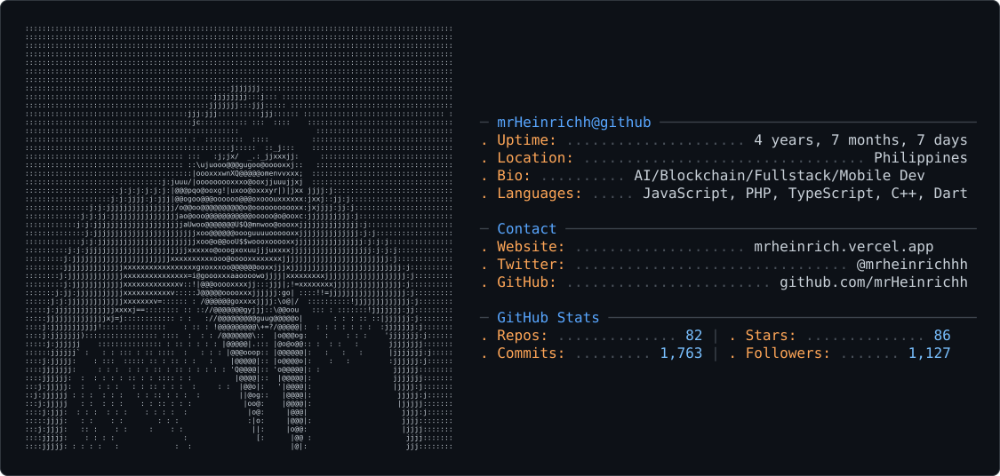

<picture>
  <source media="(prefers-color-scheme: dark)" srcset="dark_mode_dense.svg" />
  <source media="(prefers-color-scheme: light)" srcset="light_mode_dense.svg" />
  
</picture>

  
  
  

## About

AI, full-stack, and mobile developer building production web, mobile, AI, and Web3 apps end to end. I work across Flutter, React/Next.js, Node.js, Firebase, Supabase, and smart-contract integrations, with a habit of shipping fast while keeping projects modular and maintainable.

## Stacks

  

  
  
  
  
  
  
  
  
  
  
  
  
  
  
  
  
  
  
  
  
  
  
  
  
  
  

## GitHub Stats

  

  
  
  

  

## Highlights

| Project | What it is | Stack |
|---|---|---|
| [ryo-bot-studio](https://github.com/mrHeinrichh/ryo-bot-studio) | Trading studio with Rust API, Python analytics, and a Next.js frontend. | TypeScript, Rust, Python |
| [wagyu-ryochan-hackathon-entry](https://github.com/mrHeinrichh/wagyu-ryochan-hackathon-entry) | Reasoning layer for inspectable RYO market and news decisions. | Rust, AI workflows |
| [camRent-SaaS](https://github.com/mrHeinrichh/camRent-SaaS) | Camera rental SaaS with customer, owner, and admin flows. | TypeScript, React, Node |
| [forkdeck](https://github.com/mrHeinrichh/forkdeck) | Visual local Git workspace for branches, diffs, stashes, and commit profiles. | JavaScript |

## Snapshot

  
  
  

## Support

  
  

