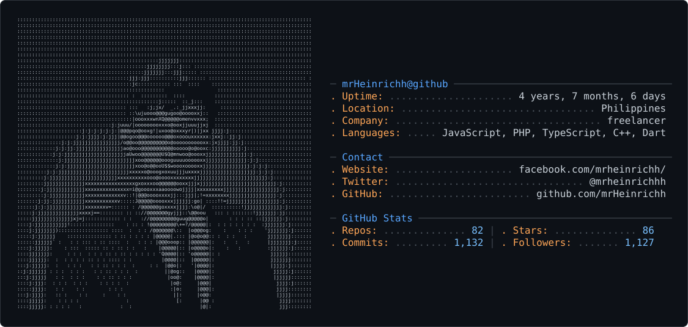

<picture>
  <source media="(prefers-color-scheme: dark)" srcset="dark_mode.svg" />
  <source media="(prefers-color-scheme: light)" srcset="light_mode.svg" />
  
</picture>
## 🌐 Portfolio Website
You can check out my portfolio website [here]([https://mrheinrich.vercel.app](https://mrheinrich.vercel.app)).

<!--  -->

## 🌐 Socials:
[\]\(https://facebook.com/mrHeinrichh](https://img.shields.io/badge/Facebook-%231877F2.svg?logo=Facebook&logoColor=white\)](https://facebook.com/mrHeinrichh)) [\]\(https://instagram.com/mrHeinrichh](https://img.shields.io/badge/Instagram-%23E4405F.svg?logo=Instagram&logoColor=white\)](https://instagram.com/mrHeinrichh)) [\]\(https://linkedin.com/in/mrHeinrichh](https://img.shields.io/badge/LinkedIn-%230077B5.svg?logo=linkedin&logoColor=white\)](https://linkedin.com/in/mrHeinrichh)) [\]\(https://tiktok.com/@mrHeinrichh](https://img.shields.io/badge/TikTok-%23000000.svg?logo=TikTok&logoColor=white\)](https://tiktok.com/@mrHeinrichh)) [\]\(https://x.com/mrHeinrichhh](https://img.shields.io/badge/X-black.svg?logo=X&logoColor=white\)](https://x.com/mrHeinrichhh)) 

# 📊 GitHub Stats:
) 
) 
)

## 🏆 GitHub Trophies
)

